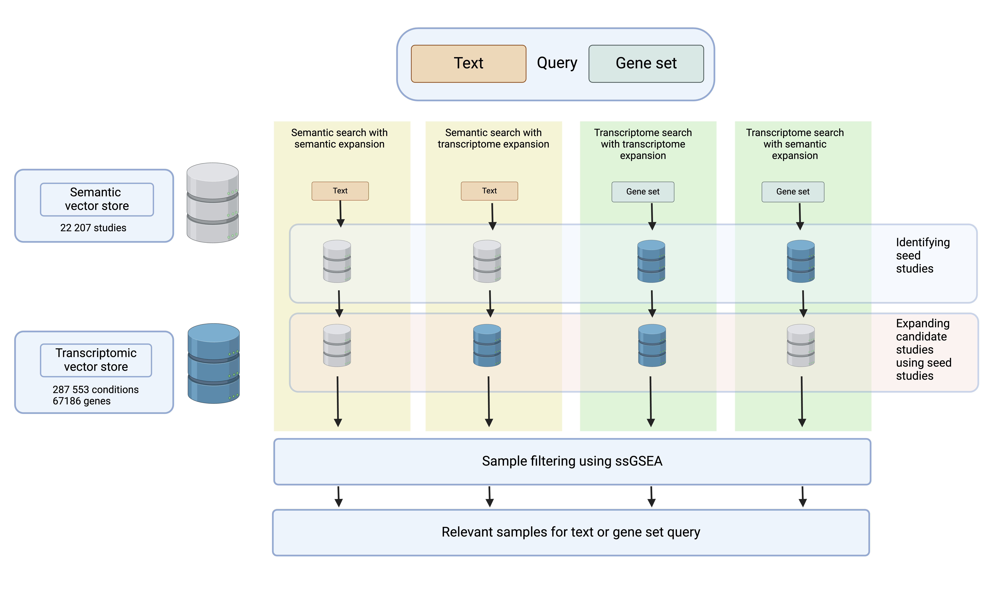

# BioRAG

This is the repository for BioRAG. BioRAG can identify gene signature enrichment under relevant transcriptomic conditions within the ARCHS4 database, using a researcher-supplied gene set or text-based experimental description. 



## Table of Contents

- [Installation](#installation)
- [Usage](#usage)
- [License](#license)

## Installation

Install BioRAG via PyPI with the following command:

    ```bash
    pip install biorag
    ```

### Additional files

These additional files will need to be downloaded. Below is a table containing a description of these files, and the links.

| File Name | Description | Link |
|-----------|-------------|------|
| semantic_db.h5ad   | semantic vector store | [Link 1](https://example.com/file1) |
| transcriptomic_db.h5ad   | transcriptomic vector store | [Link 2](https://example.com/file2) |
| human_v2.h5    | ARCHS4 count data | [Link 3](https://example.com/file3) |

## Usage

Examples and instructions on how to use the project.

To load BioRAG, follow these steps:

1. Download the following files.
2. Initialize the BioRAG object in the following way:
    
    ```python
    from biorag import query_db

    new_query_db = query_db(SEMANTIC_PATH, TRANSCRIPTOME_PATH, COUNT_H5_PATH)

    text_query = "This text query usually describes the experiment"

    geneset_query = ["IFNG", "IRF1", "IFR2"]

    new_query_db(geneset = geneset_query, text_query = text_query)

    ```

3. Run biorag with a gene set query and textual query. The gene set is a list, and the textual query is a string.

    ```python

    text_query = "This text query usually describes the experiment"

    geneset_query = ["IFNG", "IRF1", "IFR2"]

    result = new_query_db(geneset = geneset_query, text_query = text_query)

    ```

4. Modify the databases used using search in the following way.

    ```python

    
    result = new_query_db(geneset = geneset_query, text_query = text_query, search = "semantic", expand = "transcriptome")

    ```
5. The results from BioRAG are in the form of a a pandas dataframe.

## License

BioRAG is provided under the GNU General Public License (GPL), which ensures that users have the freedom to run, study, modify, and distribute the software.